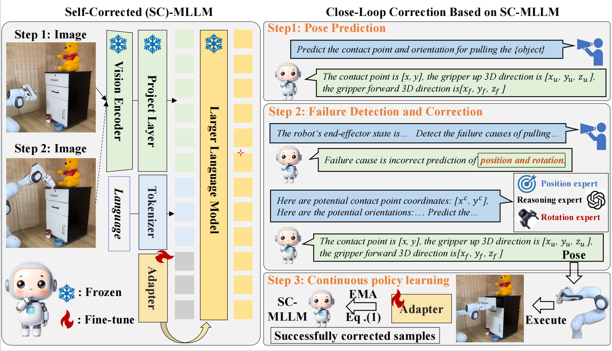
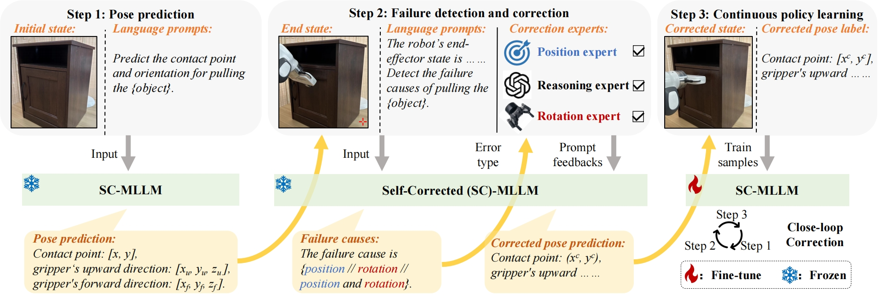
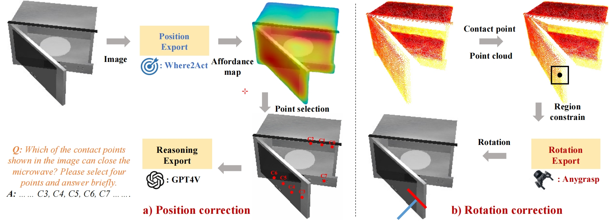

# Self-Corrected-MLLM 🤖

## Intro
Official implementation of ['Self-Corrected-Multimodal-Large-Language-Model-for-End-to-End-Robot-Manipulation'](xxx).

This repository introduces **SC-MLLM**, a Self-Corrected Multimodal Large Language Model that not only predicts end-effector poses but also autonomously recognizes and corrects errors in robotic actions. 🔥

<p align="center">                                                                                                                                           <br>
</p>
<p>Overview of our self-correction process. 
  <strong>Step 1.</strong> 
SC-MLLM reframes pose prediction as a language modeling problem, utilizing the initial state image and text prompts to generate the action pose. 
  <strong>Step 2.</strong> 
SC-MLLM exploits the end-state image and end-effector parameters for failure recognition and intelligently requests prompt feedback from experts to generate corrected poses. 
  <strong>Step 3.</strong> 
SC-MLLM continuously learns policies from successfully corrected samples, enhancing the model's adaptability to the current scene configuration. Through correction steps, we efficiently provide a customized policy for each user, rather than relying on a shared, low-accuracy policy.</p>


## Overview
<p align="center">                                                                                                                                           <br>
</p>
We integrate the LLaMA-Adapter V2 as the foundation of our MLLM to imbue it with essential reasoning abilities. Utilizing a CLIP visual encoder, we extract visual features from RGB images, while text prompts are converted into textual features using the LLaMA tokenizer. Our MLLM then uses a projection layer to align visual tokens with LLM’s token embeddings, facilitating multimodal comprehension and answer generation. During training, we fine-tune only the specific adapters within the LLM, maintaining the majority of the pre-trained parameters intact, thus preserving the model's robustness while adding new manipulation and failure correction functionalities.
<p align="center">                                                                                                                                           <br>
</p>
We present the first attempt to directly correct 6-DoF control actions of the end-effector, distinguishing our work from previous efforts that focused on high-level planning or low-level skill primitives. Initial steps involve assessing if an action has failed and pinpointing failure causes, leveraging our model's visual understanding and specific prompts for task completion confirmation, such as querying if a microwave door was closed. Unlike previous models, our SC-MLLM enhances its capabilities by fine-tuning with failure detection prompts, enabling precise identification of failure causes like position and rotation errors. Utilizing expert feedback, our SC-MLLM adapts and re-predicts correct action poses based on detected errors, integrating feedback into the correction process to refine both position and rotation actions. The system’s continuous learning from expert feedback during training enables it to substantially improve action accuracy in failure cases during practical applications.

To enhance our model's manipulation and failure correction capabilities, we co-fine-tuned it using data on pose prediction, failure detection, and correction, supervised by cross-entropy loss, and updated continuously to adapt to dynamic robot-object interactions. We integrated an exponential moving average (EMA) strategy to prevent catastrophic forgetting during fine-tuning, allowing the model to continuously learn from new data and refine its capabilities. This method enables our SC-MLLM to conduct repeated corrections and improve prediction accuracy for each specific scene configuration, effectively customizing and enhancing its performance over time.

## Open-source
Code will coming soon! 😊


## Contributors
xxx

## Citation
If you find our SC-MLLM code and paper useful, hope you can cite our article:
```bash
xxx
```

